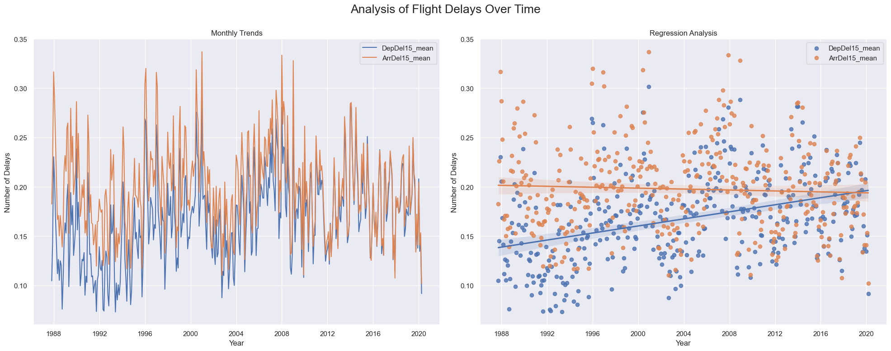
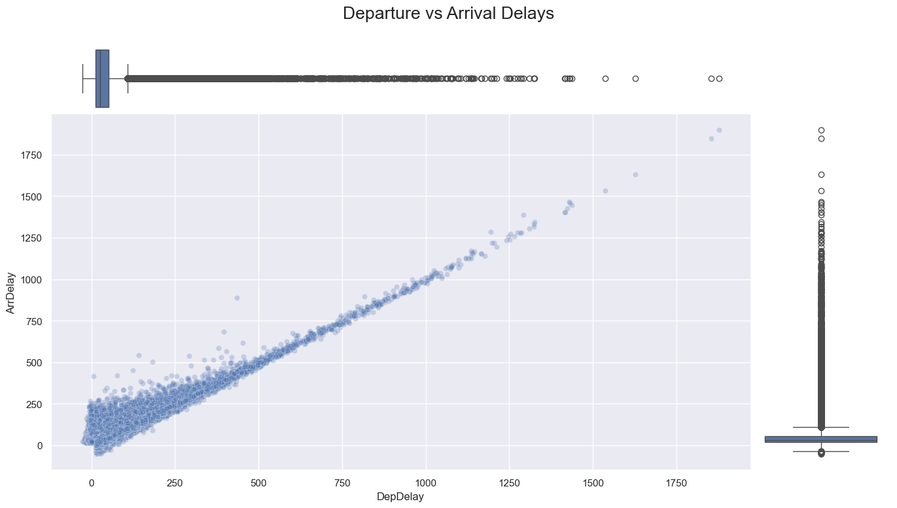
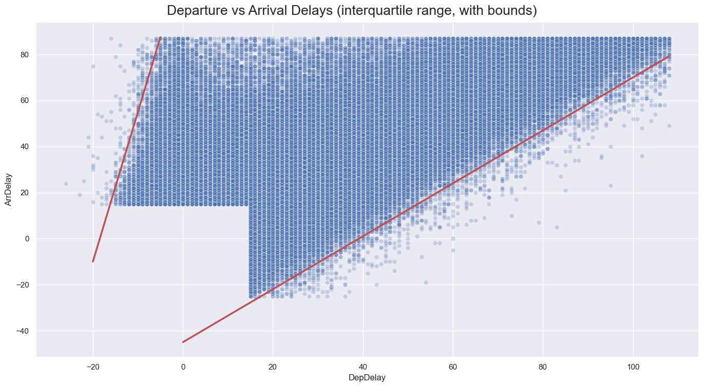
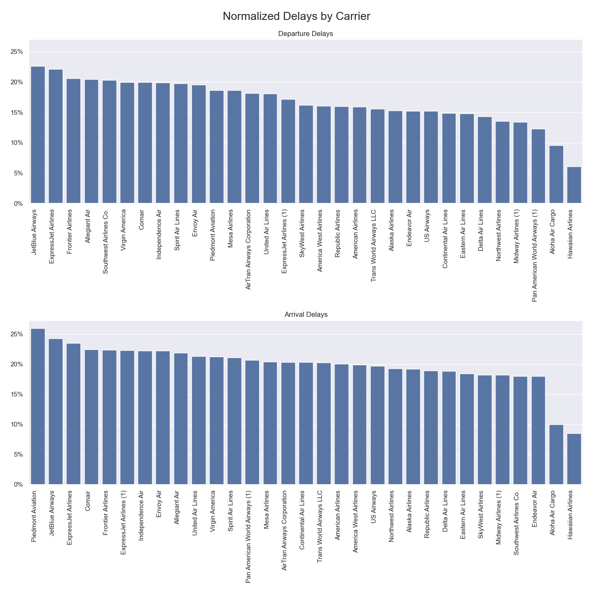
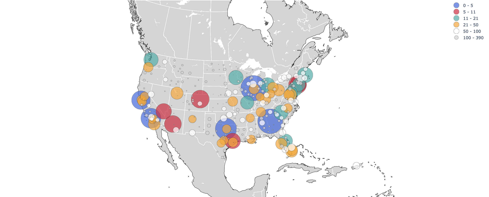

# Airline On-Time Performance
### Longitudinal Trends, Carrier Delays, and Geographic Patterns in the US Airline Industry

![matplotlib](https://img.shields.io/badge/matplotlib-white?logo=data%3Aimage%2Fsvg%2Bxml%3Bbase64%2CPD94bWwgdmVyc2lvbj0iMS4wIiBlbmNvZGluZz0iVVRGLTgiPz4KPHN2ZyB4bWxucz0iaHR0cDovL3d3dy53My5vcmcvMjAwMC9zdmciIHdpZHRoPSIxODAiIGhlaWdodD0iMTgwIiBzdHJva2U9ImdyYXkiPgo8ZyBzdHJva2Utd2lkdGg9IjIiIGZpbGw9IiNGRkYiPgo8Y2lyY2xlIGN4PSI5MCIgY3k9IjkwIiByPSI4OCIvPgo8Y2lyY2xlIGN4PSI5MCIgY3k9IjkwIiByPSI2NiIvPgo8Y2lyY2xlIGN4PSI5MCIgY3k9IjkwIiByPSI0NCIvPgo8Y2lyY2xlIGN4PSI5MCIgY3k9IjkwIiByPSIyMiIvPgo8cGF0aCBkPSJtOTAsMnYxNzZtNjItMjYtMTI0LTEyNG0xMjQsMC0xMjQsMTI0bTE1MC02MkgyIi8%2BCjwvZz48ZyBvcGFjaXR5PSIuOCI%2BCjxwYXRoIGZpbGw9IiM0NEMiIGQ9Im05MCw5MGgxOGExOCwxOCAwIDAsMCAwLTV6Ii8%2BCjxwYXRoIGZpbGw9IiNCQzMiIGQ9Im05MCw5MCAzNC00M2E1NSw1NSAwIDAsMC0xNS04eiIvPgo8cGF0aCBmaWxsPSIjRDkzIiBkPSJtOTAsOTAtMTYtNzJhNzQsNzQgMCAwLDAtMzEsMTV6Ii8%2BCjxwYXRoIGZpbGw9IiNEQjMiIGQ9Im05MCw5MC01OC0yOGE2NSw2NSAwIDAsMC01LDM5eiIvPgo8cGF0aCBmaWxsPSIjM0JCIiBkPSJtOTAsOTAtMzMsMTZhMzcsMzcgMCAwLDAgMiw1eiIvPgo8cGF0aCBmaWxsPSIjM0M5IiBkPSJtOTAsOTAtMTAsNDVhNDYsNDYgMCAwLDAgMTgsMHoiLz4KPHBhdGggZmlsbD0iI0Q3MyIgZD0ibTkwLDkwIDQ2LDU4YTc0LDc0IDAgMCwwIDEyLTEyeiIvPgo8L2c%2BPC9zdmc%2B)
![seaborn](https://img.shields.io/badge/seaborn-white?logo=data%3Aimage%2Fsvg%2Bxml%3Bbase64%2CPD94bWwgdmVyc2lvbj0iMS4wIiBzdGFuZGFsb25lPSJubyI%2FPgo8IURPQ1RZUEUgc3ZnIFBVQkxJQyAiLS8vVzNDLy9EVEQgU1ZHIDIwMDEwOTA0Ly9FTiIKICJodHRwOi8vd3d3LnczLm9yZy9UUi8yMDAxL1JFQy1TVkctMjAwMTA5MDQvRFREL3N2ZzEwLmR0ZCI%2BCjxzdmcgdmVyc2lvbj0iMS4wIiB4bWxucz0iaHR0cDovL3d3dy53My5vcmcvMjAwMC9zdmciCiB3aWR0aD0iMTg1MC4wMDAwMDBwdCIgaGVpZ2h0PSIxODUwLjAwMDAwMHB0IiB2aWV3Qm94PSIwIDAgMTg1MC4wMDAwMDAgMTg1MC4wMDAwMDAiCiBwcmVzZXJ2ZUFzcGVjdFJhdGlvPSJ4TWlkWU1pZCBtZWV0Ij4KCjxnIHRyYW5zZm9ybT0idHJhbnNsYXRlKDAuMDAwMDAwLDE4NTAuMDAwMDAwKSBzY2FsZSgwLjEwMDAwMCwtMC4xMDAwMDApIgpmaWxsPSIjMDAwMDAwIiBzdHJva2U9Im5vbmUiPgo8cGF0aCBkPSJNODgzOSAxODQ4OSBjLTIxMDMgLTk1IC00MDk2IC04OTggLTU2OTIgLTIyOTEgLTIxMCAtMTg0IC02NjUgLTYzOQotODQ2IC04NDYgLTg2OCAtOTk3IC0xNTAyIC0yMTI5IC0xODg2IC0zMzcyIC0zODkgLTEyNjAgLTUwNSAtMjU4MyAtMzM5Ci0zOTAwIDIxOCAtMTc0MiA5NDAgLTM0MDUgMjA2MyAtNDc1NCA1NjkgLTY4NCAxMjIyIC0xMjczIDE5NTYgLTE3NjYgMTIwMwotODA2IDI1NzIgLTEzMTkgNDAwNSAtMTUwMCA0MTYgLTUyIDQ3OSAtNTUgMTE1NSAtNTUgNjg4IDAgNzQwIDMgMTE5NCA2MQoxNTY5IDIwMSAzMDg4IDgxNyA0MzUxIDE3NjYgMzg1IDI4OSA2NjIgNTI5IDEwMDUgODczIDEwMTUgMTAxNiAxNzY1IDIyMjUKMjIyMCAzNTgwIDI0MCA3MTMgMzcyIDEzNDAgNDUyIDIxNDAgMTUgMTUzIDE4IDI3NyAxOCA4MjAgMCA2NzYgLTMgNzM5IC01NQoxMTU1IC0yOTQgMjMyOSAtMTQ2MCA0NDU4IC0zMjY2IDU5NjEgLTE3NjQgMTQ2OSAtNDAzOCAyMjMzIC02MzM1IDIxMjh6IG05MzEKLTMxOSBjODI2IC01MiAxNjA5IC0yMDYgMjM3MCAtNDY1IDI0MTIgLTgyMyA0MzU2IC0yNjM0IDUzNTEgLTQ5ODMgNTY1IC0xMzMzCjc5OCAtMjgwNCA2NzQgLTQyMzkgLTE0NSAtMTY2OCAtNzUxIC0zMjU2IC0xNzUwIC00NTkyIC0yNzEgLTM2MSAtNTA3IC02MzQKLTg0MCAtOTY2IC0zMzIgLTMzMyAtNjA1IC01NjkgLTk2NiAtODQwIC0xODc5IC0xNDA2IC00MjUyIC0yMDIwIC02NTY0IC0xNjk5Ci0yNzY2IDM4NCAtNTE4MyAyMDIwIC02NTYxIDQ0NDIgLTY3NSAxMTg4IC0xMDY5IDI1MTkgLTExNTQgMzkwMiAtMTMgMjE0IC0xMwo4MDMgMCAxMDIzIDEyMyAyMDU5IDk0NSA0MDA5IDIzMjcgNTUxOSAxNDIgMTU1IDQ3MSA0ODIgNjIzIDYxOSA4OTQgODA4IDE5OTIKMTQ0NiAzMTU1IDE4MzQgNzI5IDI0MyAxNTA2IDM5NCAyMjgwIDQ0NCAxOTEgMTIgODY0IDEzIDEwNTUgMXoiLz4KPHBhdGggZD0iTTY3NTAgMTAxMTMgYy0xMDIwIC0yNCAtMjA4OCAtMjcyIC0zMzYyIC03ODIgLTQ1OCAtMTgzIC04NDkgLTM1MwotMTc0MyAtNzU4IC0zNTcgLTE2MyAtNzMxIC0zMzEgLTgzMCAtMzc1IC05OSAtNDQgLTE4MSAtODEgLTE4MiAtODIgLTMgLTMgMzEKLTIzMCA1OCAtMzgxIDEzNSAtNzgxIDM5NCAtMTU3OCA3NDYgLTIzMDAgbDU4IC0xMjAgMyA0ODggMiA0ODcgMTAwNSAwIDEwMDUKMCAwIDY5NSAwIDY5NSAxMDAwIDAgMTAwMCAwIDAgMTI1IDAgMTI1IDEwNzUgMCAxMDc1IDAgMCAtNTYwIDAgLTU2MCAxMDAwIDAKMTAwMCAwIDAgLTc3MCAwIC03NzAgMTAwNSAwIDEwMDUgMCAwIC01MzAgMCAtNTMwIDEwMDAgMCAxMDAwIDAgMCAtMjI1IDAKLTIyNSAxMDAwIDAgMTAwMCAwIDAgLTE5NyAxIC0xOTggMzIgMzYgYzE4IDIwIDg0IDk3IDE0OCAxNzAgNjI5IDcyOCAxMTM1CjE1NjcgMTQ5NCAyNDc0IDEwMSAyNTcgMjE4IDU5NCAyMTEgNjEyIC0zIDcgLTEzIDEzIC0yMSAxMyAtNTIgMCAtNzk0IDE3NwotMTEzMSAyNzAgLTY2OCAxODQgLTEzNzYgNDI1IC0yMTEwIDcxOCAtNTQ3IDIxOCAtOTY3IDQwMSAtMTk5NCA4NjcgLTEzMzMKNjA1IC0xOTEzIDg0OCAtMjUzNSAxMDYyIC0xMDk5IDM4MCAtMjA3MCA1NDkgLTMwMTUgNTI2eiIvPgo8cGF0aCBkPSJNNTY1OCA0NTU4IGwtMyAtMzIzMyA4NCAtMzggYzQ4NCAtMjE3IDExMjQgLTQyNSAxNjU5IC01NDEgbDExMiAtMjQKMCAzNTM0IDAgMzUzNCAtOTI1IDAgLTkyNSAwIC0yIC0zMjMyeiIvPgo8cGF0aCBkPSJNMzY1MCA1MDY1IGwwIC0yNDc0IDExMyAtOTIgYzQ2NCAtMzgxIDEwNTUgLTc2MyAxNjE2IC0xMDQ0IGwxMzEKLTY1IDAgMzA3NSAwIDMwNzUgLTkzMCAwIC05MzAgMCAwIC0yNDc1eiIvPgo8cGF0aCBkPSJNNzY2MCAzNjgxIGwwIC0yOTg5IDY2IC0xMSBjMjYzIC00NiA1NzQgLTg2IDg2OSAtMTExIDcyIC03IDMwOSAtMTQKNTI4IC0xNyBsMzk3IC02IDAgMzA2MiAwIDMwNjEgLTkzMCAwIC05MzAgMCAwIC0yOTg5eiIvPgo8cGF0aCBkPSJNMTY0OCA1NTg4IGwtMyAtNTUzIDI5IC01NSBjNjEgLTExMiAyMTMgLTM2MSAzMzEgLTU0MCAzNjcgLTU1NiA4MjIKLTEwOTUgMTI5NSAtMTUzNiAxMDAgLTkzIDE4OCAtMTczIDE5NiAtMTc3IDEyIC03IDE0IDIyOSAxNCAxNzAzIGwwIDE3MTAKLTkzMCAwIC05MzAgMCAtMiAtNTUyeiIvPgo8cGF0aCBkPSJNOTY2MCAyODQwIGwwIC0yMjgwIDY4IDAgYzk0IDAgMzgxIDI2IDYxOCA1NSAzNDQgNDMgNjQ0IDk5IDk4NyAxODIKbDE4NyA0NiAwIDIxMzggMCAyMTM5IC05MzAgMCAtOTMwIDAgMCAtMjI4MHoiLz4KPHBhdGggZD0iTTExNjcwIDI0NzUgYzAgLTg3MiA0IC0xNTg1IDggLTE1ODUgNDEgMCA1NzIgMTgyIDgxNyAyODAgMjkxIDExNgo3MzAgMzI0IDk1NSA0NTIgbDc1IDQzIC0zIDExOTggLTIgMTE5NyAtOTI1IDAgLTkyNSAwIDAgLTE1ODV6Ii8%2BCjxwYXRoIGQ9Ik0xMzY3MCAyNjg0IGwwIC05MzYgNDggMjggYzUyOSAzMDcgMTEzNCA3NzMgMTYyNCAxMjUzIGwxODggMTgzIDAKMjA0IDAgMjA0IC05MzAgMCAtOTMwIDAgMCAtOTM2eiIvPgo8L2c%2BCjwvc3ZnPgo%3D)

This project analyzes on-time performance trends from 2 million flights across 34 years of US domestic flight data, focusing on the variations across carriers, routes, airports, and time. The goal is to conduct a comprehensive exploratory data analysis (EDA) to address key industry questions, such as identifying carriers and airports with the highest frequency of flight delays, understanding the impact of departure delays on arrival times, and examining the evolution of flight delays across three decades in the US aviation industry. The findings from the EDA will be translated into an interactive visualization dashboard using Plotly.

📄 **WRITE-UP**: [Project Write-Up](https://marcocamilo.com/portfolio/airline-performance)  
📔 **NOTEBOOK**: [Jupyter Notebook]()  

## 🚀 Key Takeaways

1. **Narrowing Gap due to 5% Increase in Departure Delays**: Over 34 years, the US airline industry shows as narrowing gap between departure and arrival delays, driven by a 5% increase in departure delays rather than a decrease in overall delays.
2. **45-Minute Limit to Minimizing Delays**: Variation in delays is bounded by two linear trends: arrival delays can only be minimized by up to 45 minutes relative to departure delays, but can exceed them by up to 250 minutes despite on-time departures.
3. **Top Delayed Carriers**: JetBlue Airways, ExpressJet Airlines, and Frontier Airlines consistently rank among the top carriers with the highest frequency of delays both at departure and arrival.
5. **Airports with Highest Delay Count**: The top five airports with the highest total delay counts are Chicago O'Hare International Airport, Hartsfield-Jackson Atlanta International Airport, Dallas/Fort Worth International Airport, Los Angeles International Airport, and San Francisco International Airport.
6. **Country-wide Issue**: The geographical spread of the top 20 airports indicates that delays are not confined to specific areas but are a nationwide issue.

[👇 Jump to results and discussion](#-results-and-discussion)

## 📂 Table of Contents

- [Key Takeaways](#-key-takeaways)
- [Table of Contents](#-table-of-contents)
- [Motivation](#-motivation)
- [Approach](#-approach)
- [Preprocessing](#-preprocessing)
- [Exploratory Data Analysis](#-exploratory-data-analysis)
- [Results and Discussion](#-results-and-discussion)
- [Future Work](#-future-work)
- [References](#-references)

## 📋 Motivation

I chose this project to challenge myself with a large longitudinal dataset and deepen my understanding of an area of personal interest: the aviation industry. Moreover, I aimed rigurous statistical and data exploration tehcniques to answer key industry question in a more accurate and insightful manner than most mainstream media reports. Additionally, this project presented an excellent opportunity to perfect my skills in exploratory data analysis, ensuring I am well-equipped to handle real-world challenges using big data.

## 🎯 Approach

1. **Data Collection**: the [Airline Reporting Carrier On-Time Performance Dataset](https://www.transtats.bts.gov/Fields.asp?gnoyr_VQ=FGJ) was sourced from the [IBM Developer](https://developer.ibm.com/exchanges/data/all/airline/) website, which contains detailed information on 2 million flights across 34 years.
2. **Data Preprocessing**: the strategy for preprocessing interleaves univariate analysis with data cleaning and feature engineering and encompassed three major aspects: exploring spread and distribution, preprocessing flight info variables, and (re)engineering time variables.
3. **Univariate Analysis**: each variable was studied for distribution, spread, and missing values, to identify patterns and trends in the data that would inform the subsequent preprocessing and analysis steps.
4. **Bivariate Analysis**: the relationships between variables were explored according to the resesarh questions.
5. **Visualization**: the findings from the analysis were translated into an interactive visualization dashboard using Plotly.

## 🔨 Preprocessing

The preprocessing strategy was designed to ensure the data was clean, consistent, and ready for analysis by using a combination of univariate analysis, data cleaning, and feature engineering. There were three areas of focus:

1. **Exploring Spread and Distribution**: the spread and distribution of each variable were analyzed to identify patterns and trends in the data that would inform subsequent preprocessing decisions.
2. **Preprocessing Flight Info Variables**: the first half of preprocessing focused on the flight information variables, including date, flight, origin/destination, and departure/arrival variables. 
3. **(Re)Engineering Time Variables**: the second half of preprocessing addressed a critical issue found in the dataset's handling of time variables, namely, how the delay variables were calculated from the raw timestamps, without accounting for time zone differences, cross-midnight flights, and daylight savings time. This extensive preprocessing required the following steps:
    a. Imputing Time Zone Information
    b. Reverse Engineering Arrival Dates
    c. Filter Remaining Negative Delays
    d. Recalculate Departure and Arrival Delays

## 🚀 Exploratory Data Analysis

The exploratory data analysis (EDA) was conducted to address four key industry questions. The questions were answered from a longitudinal perspective, taking into account the historical trends across the 34 years of data. The analysis was structured around four main themes and were answered by plotting the variables of interest:

### Longitudinal Analysis: How do delays vary across time?

### Correlation Analysis: How do delays vary across time?

    

        
    

    

        
    

### Corporate Analysis: How do delays vary across carriers?

### Geographical Analysis: How do delays vary by airport?

## 📈 Results and Discussion

### Longitudinal Analysis

The longitudinal analysis focused on understanding how delays varied across time, with the following key findings:

- **Narrowing Gap in Delays**: The evolution of delays over 34 years shows a narrowing gap between departure and arrival delays, driven by a 5% increase in departure delays rather than a decrease in arrival delays.
- **Stabilization in Volatility**: The volatility of delays has slightly decreased over the years, suggesting stabilization in seasonal delay patterns.
- **Small Decrease in Arrival Delays**: Arrival delays have decreased by only 1% over 34 years, while departure delays have increased by over 5%, indicating stagnation in improving on-time performance.

### Correlation Analysis

The correlation analysis aimed to understand the relationship between departure and arrival delays, with the following key findings:

- **Strong Positive Relationship**: Departure and arrival delays exhibit a strong positive linear relationship, with a Pearson correlation coefficient of 0.93.
- **Dispersion in Relationship**: Within the interquartile range, the correlation coefficient drops to 0.67, indicating variability in the relationship between departure and arrival delays.
- **Bounds of Delay Dispersion**: Arrival delays can be minimized by up to 45 minutes relative to departure delays, yet can exceed them by up to 250 minutes, reflecting different causes influencing each type of delay.
- **Different Causes for Delays**: Departure delays are more within the carrier's control, while arrival delays are influenced by external factors such as weather and airport congestion.
  
### Corporate Analysis

The corporate analysis aimed to understand how delays varied across carriers, with the following key findings:

- **Top Delayed Carriers**: JetBlue Airways, ExpressJet Airlines, and Frontier Airlines consistently rank among the top carriers with the highest frequency of delays, both at departure and arrival.
- **Largest Difference**: Southwest Airlines shows the largest difference between departure and arrival delays, ranking 5th in departure delays but 20th in arrival delays.
- **Indicator of Carrier Control**: Departure delays are more indicative of carrier performance, influenced by factors like boarding, fueling, and maintenance.

### Geographical Analysis

The geographical analysis aimed to understand how delays varied by airport, with the following key findings:

- **Highest Delay Counts**: The top five airports with the highest total delay counts are Chicago O'Hare International Airport, Hartsfield-Jackson Atlanta International Airport, Dallas/Fort Worth International Airport, Los Angeles International Airport, and San Francisco International Airport.
- **Coastal Congestion**: Coastal airports like Los Angeles, San Francisco, Newark, and Boston rank high among the top 15 airports, indicating congestion and operational difficulties in these regions.
- **Nationwide Issue**: The geographical spread of the top 20 airports shows that delays are widespread across the country, highlighting a nationwide issue rather than a localized problem.

## 🪐 Future Work

1. **Explore Impact of Weather**: Incorporate weather data to understand the impact of weather conditions on flight delays and identify the most common weather-related causes of delays.
2. **Longitudinal Analysis**: conduct a time series analysis to explore the evolution of these variables over time and identify any seasonal patterns or trends.
3. **Predictive Modeling**: Develop a predictive model to forecast delays based on historical data, using machine learning algorithms such as XGBoost Regressor, Random Forest Regressor, or LSTM Neural Networks.

## 📚 References

- [Reference 1]()
- [Reference 2]()
- [Reference 3]()
- [Reference 4]()
- [Reference 5]()
